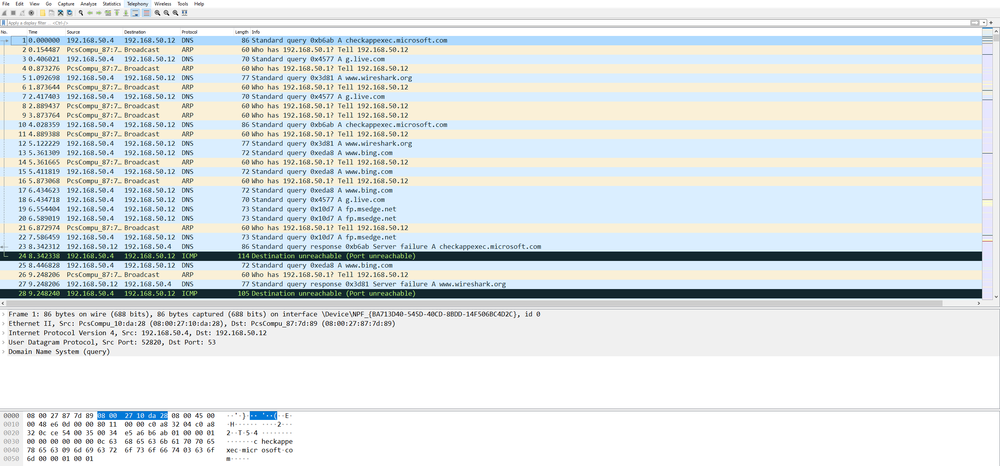
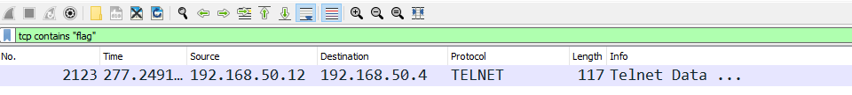
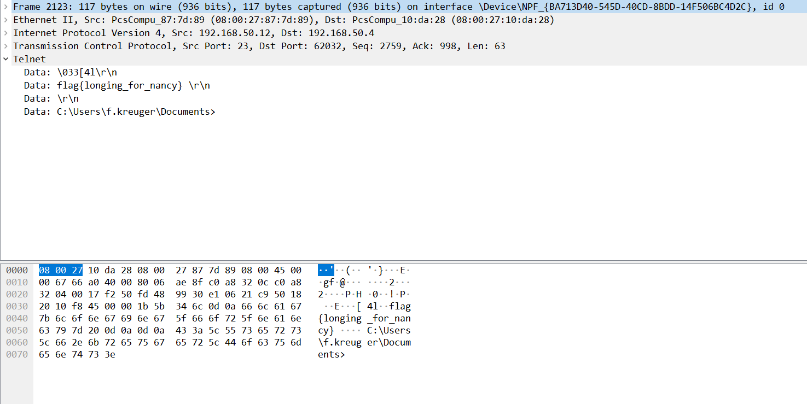

# Dreaming of You

[deadface 2022](..)  

## Problem Description

Someone doesn't understand networking traffic. Now I know their deepest crush. Can you find the flag from the PCAP file? Submit the flag as flag{text}.

[Download File](https://tinyurl.com/2p8vjhjk)  
SHA1: 1c99dee5307143e7dad0f0a19e58ad431eb5b8ce

## Write Up

The PCAP file DeadfacePCAP.pcapng is provided and can be opened with wireshark.  
The opened PCAP file should look similar to the image below.  

Adding a display filter of `tcp contains "flag"` will display only one packet containg the term "flag". The packet uses the Telnet protocol, so it transmits data in plaintext.  

The packet can be opened to find the flag.  

## Flag

flag{longing_for_nancy}
