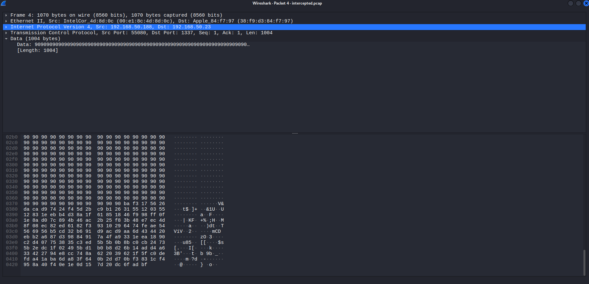
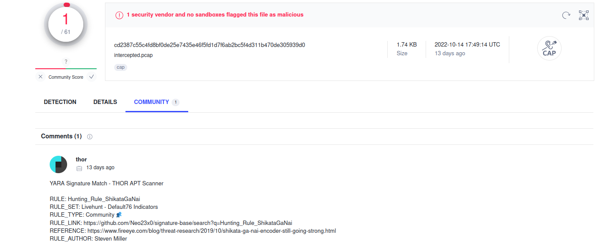
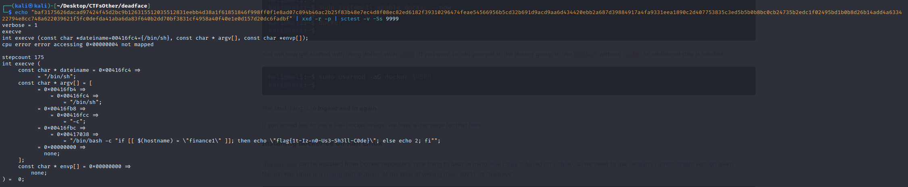

[deadface 2022](..)  

# Intercepted

## Files for problem
[Explanation and files](../Files/README.html)

## Problem Description

We intercepted an attack against the host finance1. Please help us figure out what the attack was supposed to do. The flag will be in the format flag{here-is-the-answer}.

[Download File](https://tinyurl.com/he24hwmv)  
SHA1:9bbff45efa2d6b6692a3d05dd84d92cb201630fc


## Write Up

<b>I used Kali Linux, and this solution will not work on non-Linux systems.</b>

The PCAP file has 9 packets with one of them significantly larger than the others.  
The data of the largest packet consists of a lot of 0x90 hex bytes followed by a bunch of other bytes.
The 0x90 bytes known as a No Operation (NOP) sled, as they perform no operation.  
NOP sleds are used as part of the code for a buffer overflow attack.  
The bytes after the NOP sled are what we will need.




We are told this was used for an attack, so we will upload it to [VirusTotal](https://www.virustotal.com/gui/home/upload) to see what it can tell us.  




There is one hit in VirusTotal, going to the community tab reveals the hit is for "Shikata Ga Nai".

After doing some googling Shikata Ga Nai is an encoder in Metasploit to change the signature of a payload.

There is a good explanation on the Shikata Ga Nai encoder, as well as how to decode its payloads [here](https://marcosvalle.github.io/re/exploit/2018/08/25/shikata-ga-nai.html)*.

In order to decode the payload we will need to use the `sctest` command, which is part of a package, "libemu2".  
Libemu2 is deprecated, and can now only be ran in a docker.  

To install docker, run the following commands**: 
```
sudo apt update
sudo apt install -y docker.io
sudo systemctl enable docker --now
docker
sudo usermod -aG docker $USER
```

This will allow docker to run, and now the libemu2 package can be installedsing the following command***
```
sudo apt install ./libemu2_0.2.0+git20120122-1.2build1_amd64.deb ./libemu-dev_0.2.0+git20120122-1.2build1_amd64.deb
```

Now the payload can be decoded using this code****:
```
echo "baf3175626dacad97424f45d2bc9b126315512035512831eebb4d38a1f61851846f998ff0f1e8ad07c894b46ac2b25f83b48e7ec4d8f08ec82ed6182f39310296474feae54566956b5cd32b691d9acd9aa6d434420ebb2a687d39884917a4fa9331eea1890c2d407753835c3ed5b5b0b8bc0cb24735b2edc1f02495bd1b0b8d26b14add4a633422794e8cc748a622039621f5fc0defda41aba6da83f640b2dd70bf3831cf4958a40f40e1e0d157d20dc6fadbf" | xxd -r -p | sctest -v -Ss 9999
```

The `xxd` command and flags will output the hexdump as a continuous binary stream.  
The `sctest` command will decompile the binary given to it.  
The `-v` flag makes the output more verbose, and will give us our flag.  
The `-Ss 9999` flag reads from stdin and will step 9999 times. The 9999 is arbitrary and is to make sure it fully decompiles.

The decompiled output of the above command is below.



The flag can be seen in the output.

## Flag

flag{1t-Iz-n0-Us3-Sh3ll-C0de}


&ast; This is where I got the code to decode the Shikata Ga Nai payload.  
** The code is from [this](https://www.kali.org/docs/containers/installing-docker-on-kali/) website.  
*** The files will need to be downloaded, you can get them from the "Files" folder in the same folder as this file.  
**** I used the same document from the * note to get this code.   
