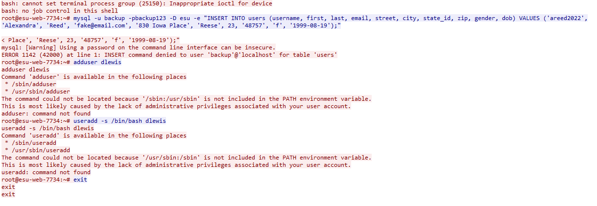

# New Addition

[deadface 2022](..)  

## Problem Description

DEADFACE tried to add a user to the ESU database. What is the username of the user they tried to add to the database?

Submit the flag as flag{username}.

Use the packet capture from Scans.

## Write Up

Filtering the PCAP with `tcp contains "user"` displays only a few packets.  
Following the stream of these packets will show the user "areed2022" being added.

The user "areed2022" was successfully added to the mysql database.  
There was also an attempt to add a user "dlewis" to the system, though this is just a red herring.

## Flag

flag{areed2022}
