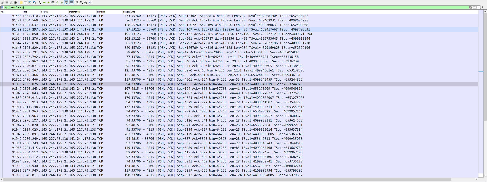
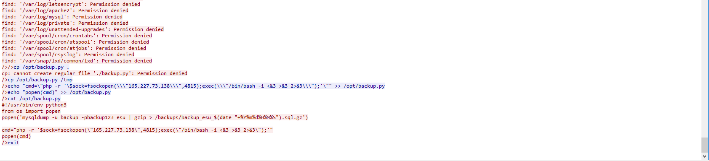

# Passing On Complexity

## Problem Description

ESU's IT staff swears up and down that the backup user's password is secure and follows best practice. Their internal auditors are not convinced and are asking for your help to determine the backup user's password at the time of the breach.

Submit the flag as flag{password}.

Use the packet capture from Scans.

## Write Up

The problem tells us we are looking for the backup user's password, so searching the file with `tcp contains "backup"` gives us this result.

The TCP stream shows what looks like someone who just got access to a system. Scrolling to the bottom of the stream a script is executed containing the password.

The python code `-u backup -pbackup123` indicates the backup user has the password "backup123".

## Flag

flag{backup123}
