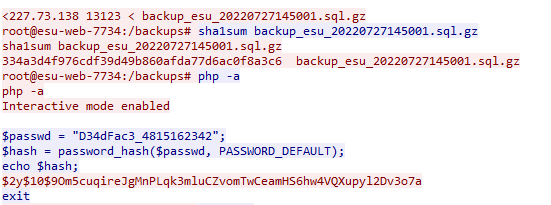

# SHAshank Redemption

## Problem Description

There is some internal back-and-forth at ESU regarding which file was exfiltrated by DEADFACE. They've asked us to determine "the hash of the file". When asked what kind of hash, they responded "It doesn't matter - anything so that we can verify the integrity of the data stolen". See if you can find a hash for the file stolen by DEADFACE within the packet capture.

Submit the flag as flag{hash}.

Use the packet capture from Scans.

## Write Up

Going to the bottom of the same TCP stream used in "The Root of All Evil" we can see the command `echo $hash` being ran.

This command outputs the Sha1 hash of the file.

## Flag

flag{$2y$10$9Om5cuqireJgMnPLqk3mluCZvomTwCeamHS6hw4VQXupyl2Dv3o7a}
