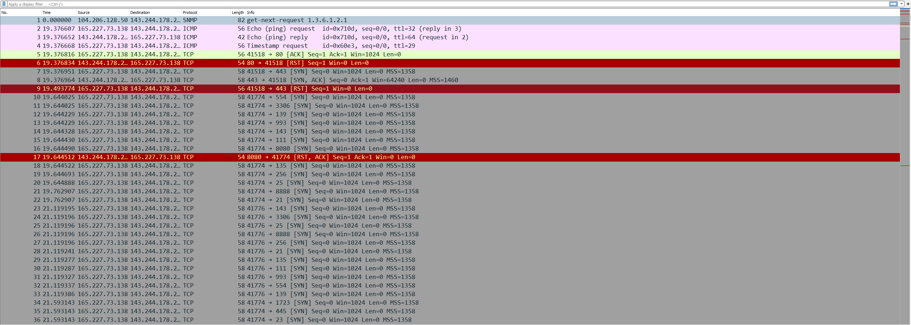

[deadface 2022](..)  

# Scans

## Problem Description

ESU's IT staff noticed some peculiar traffic from DEADFACE at the beginning of the attack. They sent a series of handshakes - the IT staff is stumped as to what DEADFACE was trying to do.

What type of scan did DEADFACE launch first?

Submit the flag as flag{scantype}.

[Download File](https://tinyurl.com/352bfsn4)  
SHA1: c2b1fcb40d8959d24e45752fbb040521c8fcb110  
Password: d34df4c3

## Write Up

The provided file is a password protected .zip file.
To obtain the PCAP file unzip it with 7zip, and then use the provided password.

After opening the PCAP, we see a lot of TCP SYN packets.  

There are roughly 2000 TCP SYN packets coming from the same source IP address, 165.227.73.138. The source is not waiting for a response, which is a sign of a SYN Scan.

SYN Scans are typically used to find open, closed, and filtered ports.

## Flag

flag{syn}
