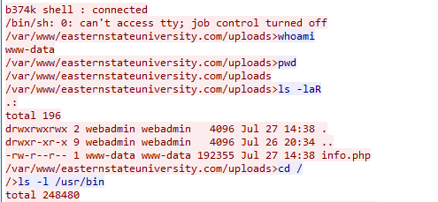

[deadface 2022](..)  

# Shells

## Problem Description

We know now that the attacker uploaded a file called info.php to gain access to the web server backend. What is the name of the tool/shell that gave the attacker a web shell?

Submit the flag as flag{tool_name}. For example: flag{psexec}.

Use the file from Scans.

## Write Up

In the last challenge, Passing on Complexity, the traffic showed someone who had used a shell to find the backup users password.  
Examining the same TCP stream the shell name can be seen at the top.

After doing some googling the shell is confirmed to be "b374k".

## Flag

flag{b374k}
