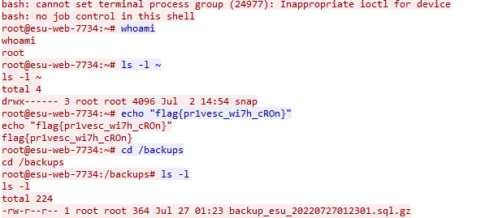

# The Root of All Evil

## Problem Description

DEADFACE is known for leaving a "calling card" on systems they exploit. What flag did the attackers leave after they gained root access to the web server?

Submit the flag as flag{flag_text}

Use the packet capture from Scans.

## Write Up

Applying a filter of `tcp contains "web"`, we see there a very few packets left, with most of them being in the same stream.
  
Following the stream the flag is very obvious, with it being echoed on the web server.

## Flag

flag{pr1vesc_wi7h_cROn}
